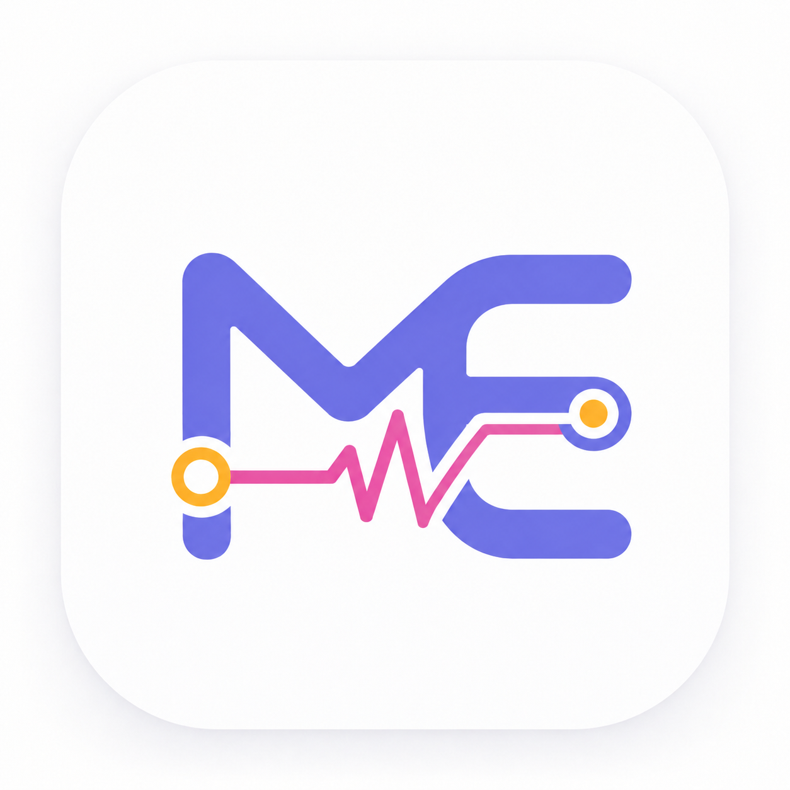

<div align="center">



# BME 教育平台 · 学员端前端

面向技术训练营的一站式学习与考勤平台 —— 课程学习 · 在线刷题 · 营期考勤 · 勋章激励 · 大模型服务

基于 Vue 3 + Vite 构建，搭载自研 **DewUI 液态玻璃** 设计语言，原生支持深色 / 浅色双主题。

`Vue 3` · `Vite 5` · `Element Plus` · `Tailwind CSS v4` · `Vuex` · `GSAP` · `DewUI`

</div>

---

## 项目简介

BME 教育平台是为线下技术训练营（嵌入式 / 编程 / EDA / 医学电子等方向）打造的一体化学员端前台。它把**课程学习、在线练习与考试、营期签到与考勤、固定座位管理、勋章激励、社区互动、大模型服务**整合在同一个品牌化的界面里，用一套自研的「液态玻璃」视觉语言贯穿全站。

本仓库是**学员端前端**（学员与导生日常使用），配合独立的后端服务与管理后台共同运行（见文末「相关仓库」）。

---

## 核心特性

- **自研 DewUI 组件库**：18 个液态玻璃组件，四层玻璃配方（半透明底 + 背景模糊 + 折射高光 + 1px 描边），深浅双主题，统一设计令牌（`tokens.css`）。访问 `/ui-showcase` 可浏览全部组件演示。
- **深色 / 浅色双主题**：基于 `.theme-dark` 切换，极光渐变衬底随主题自适应，刷新保持选择。
- **营期考勤系统**：完整的营期生命周期——选营、每日签到签退、请假审批、导生工作台（成员 / 请假 / 奖励管理）、签到看板。
- **固定座位制**：可视化座位看板，按教室与座位号呈现占用与绑定状态。
- **学习闭环**：课程浏览 → 章节学习 → 在线编程练习 → 题库 → 考试，记录学习路径与进度。
- **大模型服务中心**：对接 LiteLLM，按学员发放额度，支持额度增额申请与审批。
- **勋章激励体系**：技术勋章墙（STM32、C/C++、MATLAB、QT、VTK、Multisim 等），可视化成就。
- **社区与资讯**：动态广场、讨论互动、文章公告。
- **响应式布局**：桌面端液态玻璃导航与独立移动端导航（`MobileMenuComponent`）。

---

## 功能模块

| 模块 | 路由 | 说明 |
| --- | --- | --- |
| 首页 / 学习中心 | `/home` `/study` | 个性化问候、打卡状态、学习中心、月度统计、更新公告 |
| 课程学习 | `/study/details` `/course/chapter/:id` | 课程列表、课程详情、章节树、学习路径、学习进度 |
| 在线练习 | `/exercise/:id` | 题目描述面板 + 在线代码编辑面板 |
| 题库 | `/question-bank` | 题目检索与练习 |
| 考试 | `/exam` | 考试列表与详情 |
| 营期 | `/camp-home` `/camp` | 选营、营期主页、签到考勤、请假、导生工作台 |
| 打卡与座位 | （首页 / 营期内） | 每日打卡、打卡排行榜、座位看板 |
| 大模型服务 | `/ai-service` `/service-hall` | 模型服务大厅、额度管理、增额申请 |
| 社区 | `/community` | 动态广场、讨论卡片 |
| 勋章 | `/medal` | 个人勋章墙 |
| 资讯 | `/article` | 文章 / 公告 |
| 个人中心 | `/user` `/user-center` | 资料、头像上传、活动记录、日历、我的反馈 |
| 通知中心 | `/notifications` | 通知铃铛、通知列表（实时） |
| 关于我们 | `/about` | 团队 / 项目介绍 |
| 组件展示 | `/ui-showcase` | DewUI 全组件演示（开发参考） |

---

## 设计语言：DewUI

DewUI 是为本平台自研的液态玻璃组件库，位于 [`src/components/ui`](./src/components/ui)，通过 [`index.js`](./src/components/ui/index.js) 统一导出：

```
DewButton · DewButtonBar · DewCard · DewBadge · DewTag · DewInput · DewSwitch
DewSelect · DewPopover · DewDropdown · DewIsland · DewIslandGroup · DewPostCard
DewDialog · DewMessage · DewMessageBox · DewSidebar · DewProgress
```

设计要点：

- **四层玻璃配方**：`backdrop-filter: blur() saturate()` 模糊 + 半透明底色 + 径向折射高光 + 1px 高光描边与顶部内高光。
- **极光衬底**：多色径向渐变（蓝 / 粉 / 绿 / 琥珀）作为强调区背景，深色模式克制（透明度 0.12 ~ 0.18），浅色模式稍亮（0.20 ~ 0.26）。
- **设计令牌**：全部视觉变量集中在 [`tokens.css`](./src/components/ui/tokens.css)（`--dew-*` 玻璃变量、极光色值、语义色、`--dew-bounce` 弹性曲线），亮 / 暗双模已调好。
- **字体系统**：统一系统字体栈，并桥接 Element Plus 字体变量（`--el-font-family`），保证 EP 组件与 DewUI 视觉一致。
- **克制原则**：图标仅在确有必要处使用（`@element-plus/icons-vue`），产品界面杜绝一切 emoji。

> 开发新页面时，优先使用 DewUI 组件；DewUI 暂未覆盖的密集型组件（如复杂表格）回落到 Element Plus。

---

## 技术栈

| 分类 | 选型 |
| --- | --- |
| 框架 | Vue 3（Composition API + Options API 混用） |
| 构建工具 | Vite 5 |
| 路由 | Vue Router 4 |
| 状态管理 | Vuex 4 + vuex-persistedstate（持久化） |
| UI 组件库 | Element Plus 2.8 + @element-plus/icons-vue |
| 原子样式 | Tailwind CSS v4（经 `@tailwindcss/vite` 插件，关闭 preflight 以兼容 Element Plus） |
| HTTP | Axios |
| 动画 | GSAP |
| 工具 | js-md5（登录加密） |
| 自研 | DewUI 液态玻璃组件库 |

---

## 项目结构

```
src/
├── api.js                  # Axios 实例与接口封装
├── App.vue                 # 根组件（主题挂载）
├── main.js                 # 入口（注册 EP / 路由 / 状态 / 全局图标）
├── router.js               # 路由配置 + 登录守卫
├── store.js                # Vuex 状态（含持久化）
├── flexible.js             # 移动端 rem 适配（按需启用）
├── components/
│   ├── ui/                 # DewUI 液态玻璃组件库（18 个 + tokens.css + index.js）
│   ├── Auth/               # 登录 / 注册 / 找回密码
│   ├── Home/               # 首页：问候 / 打卡 / 学习中心 / 直播 / 月度统计 / 公告 / 反馈
│   ├── Course/             # 课程列表 / 详情 / 章节树 / 学习路径 / 进度
│   ├── Exercise/           # 在线练习：描述面板 / 代码面板 / 头部
│   ├── Camp/               # 营期：选营 / 考勤 / 请假 / 导生工作台
│   ├── Attendence/         # 每日打卡 / 打卡排名
│   ├── SeatMap/            # 座位看板（教室注册表 + 可视化座位图）
│   ├── Community/          # 社区：动态卡 / 讨论卡 / 侧边栏
│   ├── User/               # 个人中心：资料 / 头像 / 活动 / 日历 / 勋章 / 反馈
│   ├── Notification/       # 通知铃铛 / 通知列表
│   ├── MenuComponent.vue   # 液态玻璃主导航
│   ├── MobileMenuComponent.vue  # 移动端导航
│   └── PageFooterComponent.vue
├── composables/            # 组合式函数（useNotifications 等）
├── services/               # 业务服务层（campService / notificationService）
├── config/version.js       # 版本与更新公告配置
├── mock/                   # Mock 数据配置
├── styles/main.css         # 全局样式（Tailwind 引入 + 字体桥接）
└── views/                  # 页面级视图
```

---

## 快速开始

### 环境要求

- Node.js ≥ 18
- npm（或 pnpm / yarn）

### 安装与运行

```bash
# 安装依赖
npm install

# 启动开发服务器（默认端口 8081）
npm run dev

# 生产构建
npm run build

# 本地预览构建产物
npm run preview
```

开发服务器启动后访问 `http://localhost:8081/AMEII/`（`base` 路径为 `/AMEII/`，见下文配置）。

---

## 可用脚本

| 命令 | 作用 |
| --- | --- |
| `npm run dev` | 启动 Vite 开发服务器（端口 8081，host 0.0.0.0） |
| `npm run build` | 生产构建到 `dist/` |
| `npm run preview` | 本地预览构建产物 |
| `npm run release <ver> <notes...>` | 发布指定版本并写入更新公告（见下文） |
| `npm run version:patch` | 补丁号自增并发布（x.y.Z） |
| `npm run version:minor` | 次版本自增并发布（x.Y.0） |
| `npm run version:major` | 主版本自增并发布（X.0.0） |

---

## 版本管理

项目遵循 [语义化版本](https://semver.org/lang/zh-CN/)，更新历史见 [CHANGELOG.md](./CHANGELOG.md)。

版本号集中在 [`package.json`](./package.json) 的 `version` 字段，由 [`release.js`](./release.js) 在发布时统一写入并生成更新公告；构建时 [`vite.config.js`](./vite.config.js) 读取该版本号注入全局变量 `__APP_VERSION__`，供前端展示当前版本。

```bash
# 发布新版本（推荐）
npm run release 3.0.1 "新增营期签到看板" "优化深色模式对比度"

# 或自动递增版本号
npm run version:patch
```

> 建议设置 Git 提交模板以规范提交信息：`git config commit.template .gitmessage`

---

## 配置说明

关键配置位于 [`vite.config.js`](./vite.config.js)：

| 项 | 值 | 说明 |
| --- | --- | --- |
| `base` | `/AMEII/` | 部署子路径，构建产物的资源前缀 |
| `server.port` | `8081` | 开发服务器端口 |
| `server.host` | `0.0.0.0` | 允许局域网访问 |
| `resolve.alias['@']` | `src` | 路径别名，`@/...` 指向 `src/...` |
| `define.__APP_VERSION__` | 取自 package.json | 构建期注入的版本号 |

主题切换由 Vuex 状态驱动，根节点挂 `.theme-dark` / `.theme-light`，刷新后通过 `vuex-persistedstate` 保持。

---

## 开发约定

- **无 emoji**：产品界面杜绝 emoji，图标统一使用 `@element-plus/icons-vue`，且仅在确有语义必要时使用。
- **字体**：使用 DewUI 系统字体栈，禁止引入外网字体 CDN。
- **优先 DewUI**：新页面优先复用 DewUI 组件；访问 `/ui-showcase` 查阅组件清单与用法。
- **视觉变量**：颜色 / 圆角 / 间距 / 玻璃配方统一走 `tokens.css` 的 `--dew-*` 令牌，避免硬编码。

---

## 相关仓库

BME 教育平台由多个仓库协同组成：

| 仓库 | 职责 |
| --- | --- |
| **BME_frontend**（本仓库） | 学员端前端（Vue 3） |
| **BME_platform_flask** | 后端服务（Flask + MySQL + SQLAlchemy + JWT） |
| **BME_backend** | 管理后台前端（Vue 3 + Element Plus，复用 DewUI 令牌） |
| **BME_3DFarm** | 3D 打印农场（独立子项目，同技术栈） |

---

## 反馈

发现问题或有意贡献，欢迎提 Issue 或 Pull Request。也可通过站内「反馈气泡」直接反馈。
